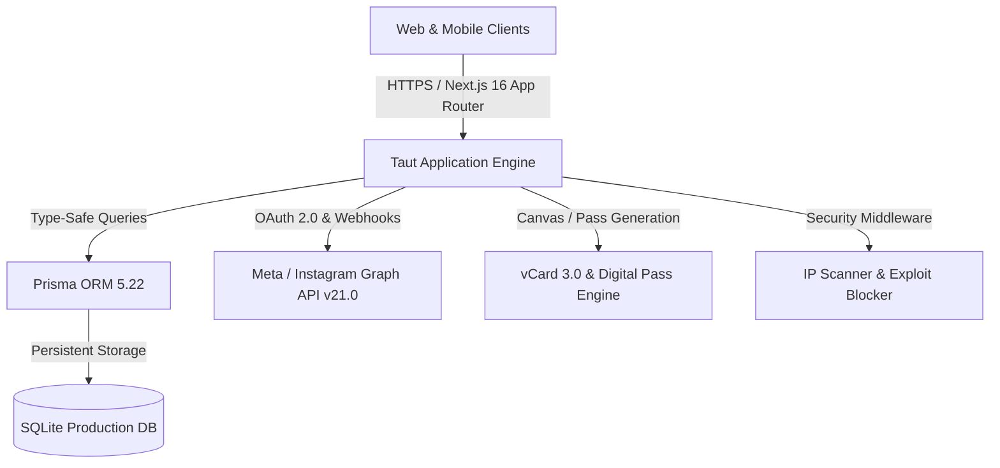

# Taut — Next-Gen Link-in-Bio & Creator Monetization Platform

<div align="center">

```
  ████████╗ █████╗ ██╗   ██╗████████╗
  ╚══██╔══╝██╔══██╗██║   ██║╚══██╔══╝
     ██║   ███████║██║   ██║   ██║   
     ██║   ██╔══██║██║   ██║   ██║   
     ██║   ██║  ██║╚██████╔╝   ██║   
     ╚═╝   ╚═╝  ╚═╝ ╚═════╝    ╚═╝   
```

**One link to unite everything. Built for creators, digital entrepreneurs, and modern brands.**

[](https://nextjs.org/)
[](https://turbo.build/)
[](https://www.prisma.io/)
[](https://www.sqlite.org/)
[](https://tailwindcss.com/)
[](https://www.typescriptlang.org/)
[](LICENSE)

[🌐 Live Platform](https://taut.ilrksy.com) • [📖 Key Features](#-key-features) • [🖼️ Screenshots](#-visual-showcase) • [🚀 Getting Started](#-getting-started) • [🏗️ Architecture](#-system-architecture) • [🔒 Security](#-security--data-integrity) • [📄 License](#-license)

</div>

---

## 🖼️ Visual Showcase

<div align="center">
  
</div>

<br/>

<div align="center">

| **1. Creator Dashboard & Links** | **2. Presets & Theme Customizer** |
| :---: | :---: |
|  |  |

| **3. Micro-Store & Digital Products** | **4. Real-Time Insights & Analytics** |
| :---: | :---: |
|  |  |

| **5. Digital Business Cards & Wallet** | **6. Meta & Instagram Auto-Reply** |
| :---: | :---: |
|  |  |

| **7. Multi-Taut Page Manager** | **8. Figma-Grade Visual Studio (Dark)** |
| :---: | :---: |
|  |  |

</div>

---

## 📌 Overview

**Taut** is a high-performance, all-in-one digital identity, link-in-bio, and creator monetization platform engineered as a next-generation alternative to Linktree, Bento, and Beacons. It features a Figma-grade visual drag-and-drop customizer, automated 24/7 Meta & Instagram social auto-reply via Graph API webhooks, digital business pass creation (Apple Wallet, Google Wallet & native vCard 3.0), micro-store showcases, rich media embeds, and real-time deep analytics.

---

## ✨ Key Features

### 1. 🎨 Visual Studio & Bento Customizer (Figma-Grade)
* **Custom Layouts**: Flexible presentation modes including *List*, *Grid*, *Bento Grid*, *Masonry*, and *Carousel*.
* **Dynamic Backgrounds**: Neutral earth-tone palettes, ambient CSS gradients, animated GIFs, and direct background video streaming.
* **Typography & Card Geometry**: Granular card sizing (*compact*, *standard*, *large*, *banner*) and border aesthetics (*rounded*, *pill*, *sharp*, *glassmorphism*).
* **Live Drag-and-Drop Preview**: Real-time arrangement with smooth framer-motion micro-interactions and instant autosave.

### 2. 🤖 Meta & Instagram Auto-Reply 24/7 (Real Graph API)
* **Keyword-Triggered Comment Replies**: Real-time detection of comments on Instagram *Posts* and *Reels*, automatically dispatching public reply links.
* **Instant Direct Messaging (DM)**: Automatically sends exclusive bio links, recipe sheets, or digital products directly to followers' inboxes.
* **Enterprise Webhook Gateway**: Secure Meta webhook endpoint with challenge verification and signature security.

### 3. 🪪 Digital Business Passes & Mobile Wallets
* **Direct 1-Tap Phone Contacts (vCard 3.0)**: Save phone numbers, bio details, emails, and profile links directly into iOS & Android native contact books.
* **Apple & Google Wallet Ready**: Digital pass (`.pkpass`) support and Google Wallet integration.
* **Multi-Format High-Res Exports**: Client-side canvas rendering for **PNG Images**, print-ready **PDF Passes**, and vector **SVG**.

### 4. 🛍️ Micro-Store & Product Showcases
* Automated product card generator with real-time pricing, multi-currency support (`RM`, `USD`, `SGD`, `EUR`, `IDR`), and call-to-action (*CTA*) buttons.
* Smart brand and favicon detection for Shopee, TikTok Shop, Lazada, Etsy, Gumroad, and custom domains.

### 5. 🎵 Interactive Media & Streaming Widgets
* Embed interactive players and previews for Spotify, Apple Music, SoundCloud, YouTube Shorts, TikTok, and X (Twitter).

### 6. 📊 Deep Analytics & Lead Generation
* Track total impressions, unique visitor counts, link click-through rates (CTR), device breakdowns, and geographic distributions.
* Lead capture forms with 1-click CSV data export for CRM synchronization.

### 7. 🛡️ Security, Rate-Limiting & Anti-Exploit Engine
* **Automated Threat Detection**: Real-time IP intelligence supporting Cloudflare headers (`cf-connecting-ip`) and reverse proxies (`x-forwarded-for`).
* **Hidden Admin Control Center**: Monitor platform transactions, manage support ticket channels, and execute instant account/IP bans.

---

## 🏗️ System Architecture



### Tech Stack Breakdown

| Layer | Technologies | Description |
| :--- | :--- | :--- |
| **Framework** | Next.js 16.3 (Turbopack, App Router) | React Server Components, Server Actions, Dynamic Streaming |
| **Styling & UI** | Tailwind CSS v4 + Lucide Icons | Responsive, accessible, earth-tone aesthetic |
| **Database** | SQLite + Prisma ORM 5.22 | Clean relational architecture with cascading delete rules |
| **Auth** | Session Cookies + OAuth 2.0 | Google Identity, Meta/Facebook OAuth, and secure credentials |
| **Integrations** | Meta Graph API v21.0 & Webhooks | Real-time social automation, comment monitoring, and automated DM dispatch |

---

## 📂 Project Directory Structure

```text
my-fullstack-app/
├── prisma/
│   ├── schema.prisma          # Database models, relations & indexes
│   └── dev.db                 # SQLite database file
├── public/
│   ├── tat/                   # Project assets & media gallery
│   └── logo.png               # Official Taut branding asset
├── src/
│   ├── app/
│   │   ├── [username]/        # Dynamic public creator profile routes
│   │   ├── admin/             # Protected administrative dashboard
│   │   ├── api/
│   │   │   ├── auth/          # OAuth endpoints (Google, Facebook, Instagram)
│   │   │   ├── vcard/         # vCard 3.0 contact file generator (.vcf)
│   │   │   ├── wallet/        # Apple & Google Wallet pass endpoints
│   │   │   └── webhook/meta/  # Meta Webhook verification & handler
│   │   ├── dashboard/         # Creator studio workspace & visual customizer
│   │   ├── login/ & signup/   # Authentication & registration pages
│   │   ├── layout.tsx         # Root application layout
│   │   └── page.tsx           # High-converting landing page
│   ├── components/
│   │   ├── BrandIcons.tsx     # Vector brand & platform icons
│   │   ├── SocialIcons.tsx    # Social platform icons (IG, Spotify, NPM, etc.)
│   │   └── ui/                # UI components (Gradient footer, modals, navbar)
│   └── lib/
│       ├── brandDetector.ts   # Domain brand & favicon extractor
│       ├── prisma.ts          # Singleton Prisma database client
│       ├── security.ts        # Security logging, IP detection & anti-exploit
│       └── session.ts         # User session & cookie handlers
├── .env                       # Environment variables configuration
├── next.config.ts             # Next.js configuration
└── package.json               # Project manifest & dependencies
```

---

## 🚀 Getting Started

### Prerequisites
* **Node.js** v18.18.0 or higher
* **npm**, **pnpm**, or **yarn**

### 1. Clone the Repository
```bash
git clone https://github.com/your-username/taut.git
cd taut
```

### 2. Install Dependencies
```bash
npm install
```

### 3. Setup Environment Variables (`.env`)
Create a `.env` file in the root directory:
```env
# DATABASE
DATABASE_URL="file:./dev.db"

# APPLICATION DOMAIN
NEXT_PUBLIC_APP_URL="http://localhost:3000"

# GOOGLE OAUTH
GOOGLE_CLIENT_ID="your_google_client_id"
GOOGLE_CLIENT_SECRET="your_google_client_secret"

# META / FACEBOOK / INSTAGRAM API
FACEBOOK_APP_ID="your_meta_app_id"
FACEBOOK_APP_SECRET="your_meta_app_secret"
INSTAGRAM_APP_ID="your_instagram_app_id"
INSTAGRAM_APP_SECRET="your_instagram_app_secret"
META_WEBHOOK_VERIFY_TOKEN="your_custom_verify_token"

# META GRAPH API TOKEN (AUTO-REPLY ENGINE)
INSTAGRAM_ACCESS_TOKEN="your_meta_access_token"
META_USER_ACCESS_TOKEN="your_meta_access_token"
```

### 4. Run Database Migrations
```bash
npx prisma db push
# or
npx prisma migrate dev
```

### 5. Start Development Server
```bash
npm run dev
```
Navigate to [http://localhost:3000](http://localhost:3000) in your browser.

---

## 🛠️ CLI Scripts

| Command | Description |
| :--- | :--- |
| `npm run dev` | Starts the local Turbopack development server |
| `npm run build` | Compiles and optimizes the application for production |
| `npm run start` | Runs the compiled production build |
| `npm run lint` | Executes TypeScript and ESLint code quality checks |
| `npx prisma studio` | Opens an interactive GUI to view and edit database records |

---

## 🔒 Security & Data Integrity

* **DDoS & Brute-Force Mitigation**: Automatic IP resolution across reverse proxy and Cloudflare headers.
* **Session Hardening**: Secure, HTTP-only cookie-based authentication with strict SameSite attributes.
* **Relational Safety**: Full foreign-key constraints with transactional data cascades across users, pages, links, and analytics.

---

## 📄 License

This project is open-source software licensed under the [MIT License](LICENSE).

---

<div align="center">
  <sub>Engineered with precision for creators and digital entrepreneurs worldwide.</sub>
</div>
# Taut
